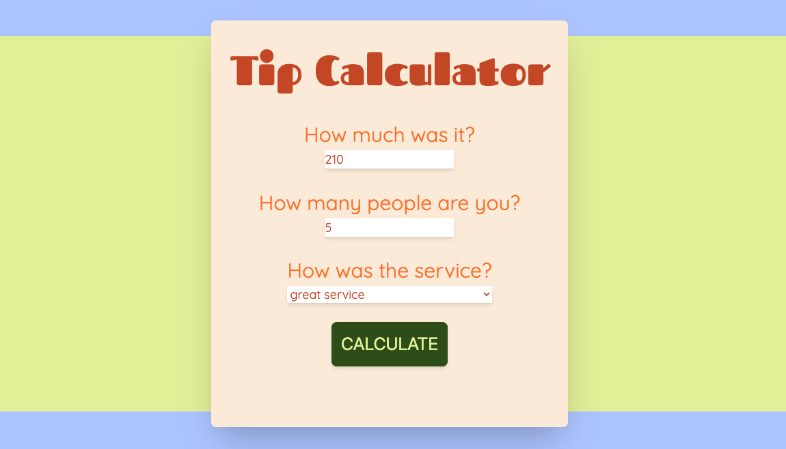
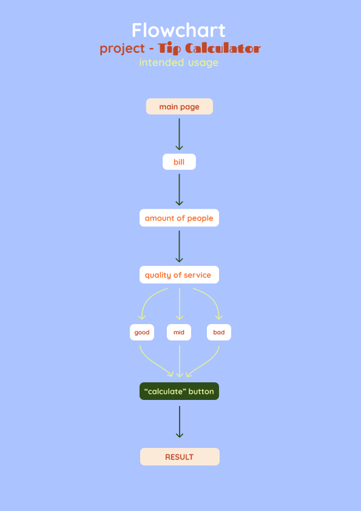

# Tip Calculator

## description

This project is a Tip-Calculator, which lets the user calculate the tip, whole bill and money per person by asking for the bill price, the amount of people and the quality of service. The design is simple with a fun main font and a 70´s color-sheme.

## function

- Input field for bill price, people sharing and the quality of service
- "calculate" button to give out the result of the calculated tip, the bill price and the price per person

## technology

- HTML
- Tailwind
- Typescript

## install:

clone this repository: https://github.com/KiBohr/-bungsordner_kb/tree/main/src/24.12.24%20%2B%2031.12.24_%20Projekt%20Trinkgeldrechner
